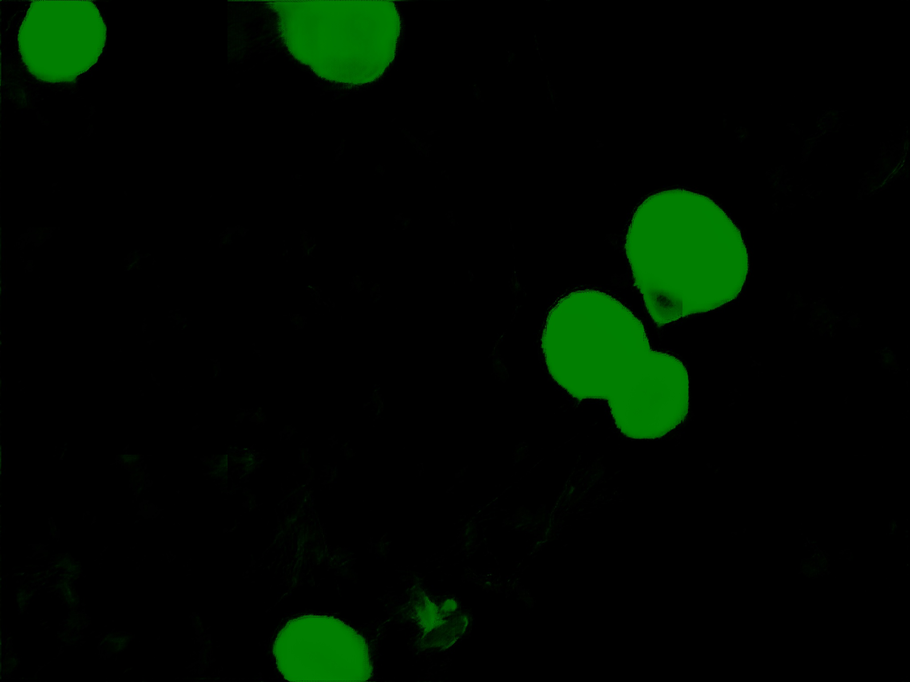
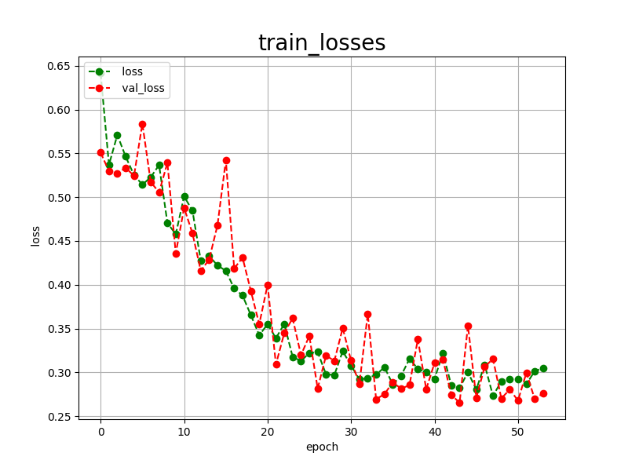
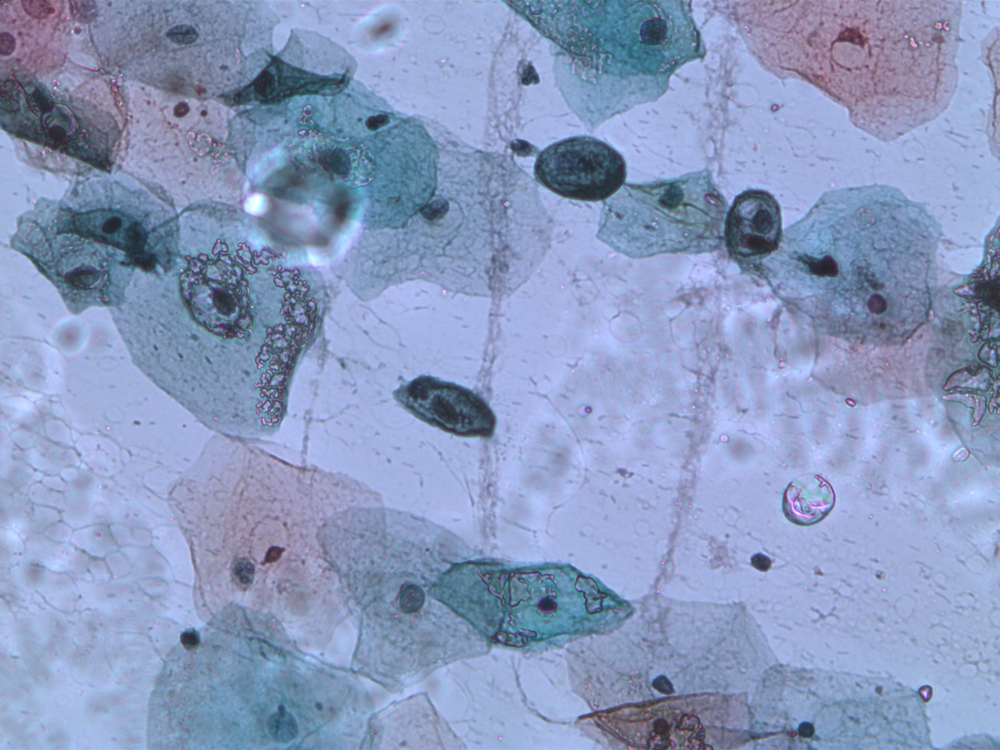
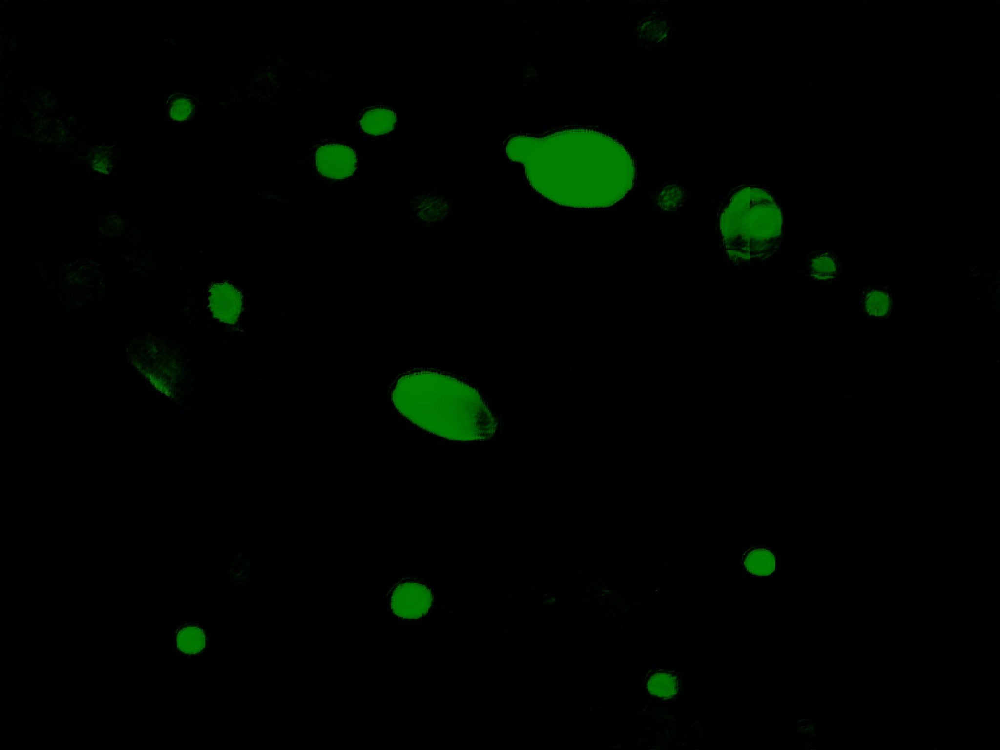
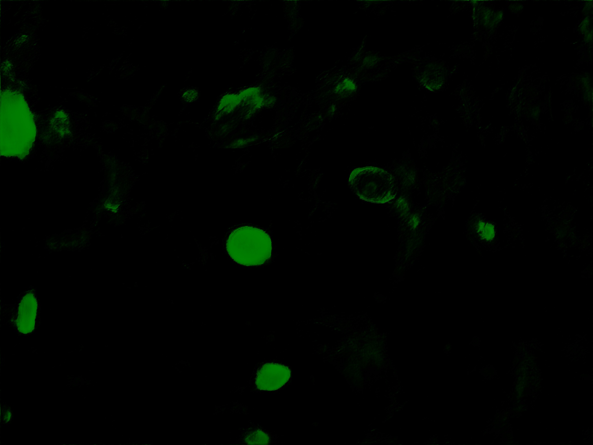
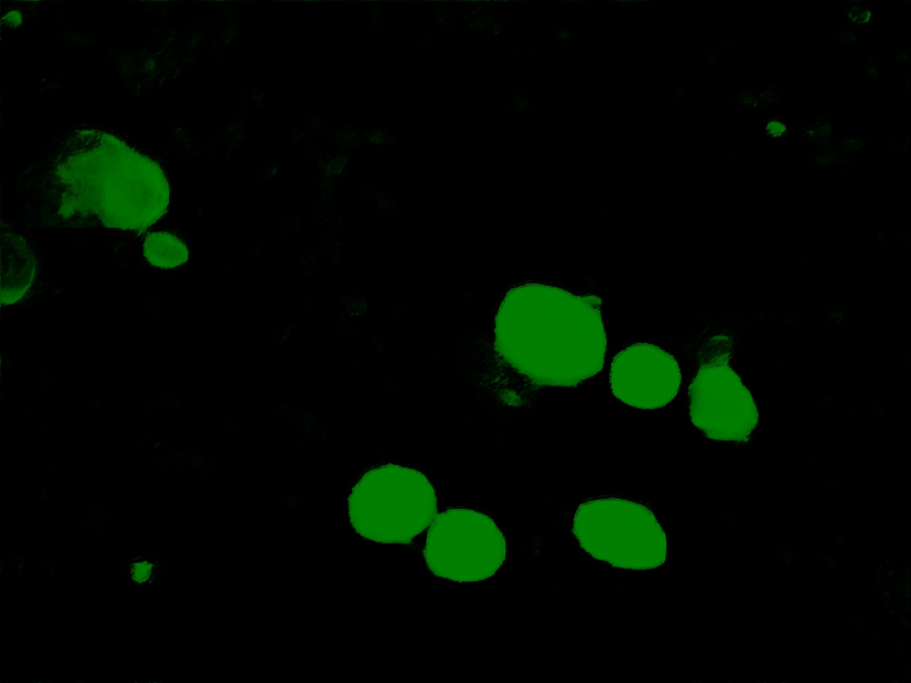

<h2>Tensorflow-Tiled-Image-Segmentation-Augmented-Cervical-Cancer (2024/06/18)</h2>

This is an experiment of Tiled Image Segmentation for Cervical-Cancer based on
the <a href="https://github.com/sarah-antillia/Tensorflow-Image-Segmentation-API">Tensorflow-Image-Segmentation-API</a>, and
<a href="https://drive.google.com/file/d/1YEwgvxrdV7738Vd0XmkBGgA3lWRE-BWx/view?usp=sharing">
Tiled-Cervical-Cancer-ImageMask-Dataset-X</a> 
, which was derived by us from the original 
data <a href="https://www.kaggle.com/datasets/prahladmehandiratta/cervical-cancer-largest-dataset-sipakmed">Cervical Cancer largest dataset (SipakMed)</a>
 in the website of kaggle.com
 
 
Please see also our experiments.  
<a href="https://github.com/atlan-antillia/Image-Segmentation-Cervical-Cancer">Image-Segmentation-Cervical-Cancer</a>.
 
<a href="https://github.com/sarah-antillia/Tensorflow-Image-Segmentation-Cervical-Cancer">Tensorflow-Image-Segmentation-Cervical-Cancer</a>.
 
 
In this experiment, we employed the following strategy: 
<b>
 
1. We trained and validated a TensorFlow UNet model using the Tiled-Cervical-Cancer-ImageMask-Dataset, which was tiledly-split to 512x512
 and reduced to 512x512 image and mask dataset. 
2. We applied the Tiled-Image Segmentation inference method to predict the skin-cancer regions for the test images 
with a resolution of 2K pixels. 
  
</b>  
 Please note that <a href="https://drive.google.com/file/d/1YEwgvxrdV7738Vd0XmkBGgA3lWRE-BWx/view?usp=sharing">
 Tiled-Cervical-Cancer-ImageMask-Dataset-X</a> contains two types of images and masks:
   
1. Tiledly-split to 512x512 image and mask  files. 
2. Size-reduced to 512x512 image and mask files. 

Namely, this is a mixed set of Tiled and Non-Tiled ImageMask Datasets. 

Actual Tiled Image Segmentation for the images of 2K pixels. 
As shown below, the tiled inferred regions predicted by this segmentation model were not perfect, but almost succeful.

<table>
<tr>
<th>Input: image</th>
<th>Mask (ground_truth)</th>
<th>Prediction: tiled_inferred_mask</th>
</tr>
<tr>
<td width="330" ></td>

<td width="330" ></td>
<!--
<td></td>
 -->
<td width="330"></td>
</tr>
<tr>
<td width="330" ></td>

<td width="330" ></td>
<!--
<td></td>
 -->
<td width="330"></td>
</tr>
</table>

 
In this experiment, we have used the simple UNet Model 
<a href="./src/TensorflowUNet.py">TensorflowSlightlyFlexibleUNet</a> for this Cervical-Cancer Segmentation. 
As shown in <a href="https://github.com/sarah-antillia/Tensorflow-Image-Segmentation-API">Tensorflow-Image-Segmentation-API</a>.
you may try other Tensorflow UNet Models: 

<li><a href="./src/TensorflowSwinUNet.py">TensorflowSwinUNet.py</a></li>
<li><a href="./src/TensorflowMultiResUNet.py">TensorflowMultiResUNet.py</a></li>
<li><a href="./src/TensorflowAttentionUNet.py">TensorflowAttentionUNet.py</a></li>
<li><a href="./src/TensorflowEfficientUNet.py">TensorflowEfficientUNet.py</a></li>
<li><a href="./src/TensorflowUNet3Plus.py">TensorflowUNet3Plus.py</a></li>
<li><a href="./src/TensorflowDeepLabV3Plus.py">TensorflowDeepLabV3Plus.py</a><li>
 

<h3>1. Dataset Citation</h3>
The original dataset used here has been taken from the following kaggle website: 
<b>Cervical Cancer largest dataset (SipakMed)</b> 
<pre>
https://www.kaggle.com/datasets/prahladmehandiratta/cervical-cancer-largest-dataset-sipakmed
</pre>
<pre>
About Dataset
Please don't forget to upvote if you find this useful.
Context
Cervical cancer is the fourth most common cancer among women in the world, estimated more than 0.53 million 
women are diagnosed in every year but more than 0.28 million women’s lives are taken by cervical cancer 
in every years . Detection of the cervical cancer cell has played a very important role in clinical practice.

Content
The SIPaKMeD Database consists of 4049 images of isolated cells that have been manually cropped from 966 cluster
 cell images of Pap smear slides. These images were acquired through a CCD camera adapted to an optical microscope. 
 The cell images are divided into five categories containing normal, abnormal and benign cells.

Acknowledgements
IEEE International Conference on Image Processing (ICIP) 2018, Athens, Greece, 7-10 October 2018.

Inspiration
CERVICAL Cancer is an increasing health problem and an important cause of mortality in women worldwide. 
Cervical cancer is a cancer is grow in the tissue of the cervix . It is due to the abnormal growth of cell that 
are spread to the other part of the body.
Automatic detection technique are used for cervical abnormality to detect Precancerous cell or cancerous cell 
than no pathologist are required for manually detection process.
</pre>

 

<h3>
<a id="2">
2 Tiled-Cervical-Cancer ImageMask Dataset
</a>
</h3>
 If you would like to train this Cervical-Cancer Segmentation model by yourself,
 please download the dataset from the google drive 
<a href="https://drive.google.com/file/d/1YEwgvxrdV7738Vd0XmkBGgA3lWRE-BWx/view?usp=sharing">
Tiled-Cervical-Cancer-ImageMask-Dataset-X.zip</a>,
Please refer to the dataset augmentation tool 
<a href="https://github.com/sarah-antillia/ImageMask-Dataset-Cervical-Cancer">ImageMask-Dataset-Cervical-Cancer</a>.

 

 
Please expand the downloaded ImageMaskDataset and place them under <b>./dataset</b> folder to be
<pre>
./dataset
└─Tiled-Cervical-Cancer
    └─Metaplastic
        ├─test
        │  ├─images
        │  └─masks
        ├─train
        │  ├─images
        │  └─masks
        └─valid
            ├─images
            └─masks

</pre>
 
<b>Cervical-Cancer Metaplastic Statistics</b> 
 
 
As shown above, the number of images of train and valid dataset is not necessarily large. 
Therefore, an online dataset augmentation by  <a href="./src/ImageMaskAugmentor.py">Augmentation Tool</a>
strategy to train this Skin-Cancer model may be effective to get a better trained model. 
In order to enable the online Augmentation Tool, you set <b>generator</b> parameter to be True as shown below.
<pre>
[model]
generator = True
</pre>

 

 
<b>Train_Metaplastic_images_sample</b> 

 
<b>Train_Metaplastic_masks_sample</b> 

 

<h2>
3 Train TensorflowUNet Model
</h2>
 We have trained Cervical-Cancer TensorflowUNet Model by using the following
<a href="./projects/TensorflowSlightlyFlexibleUNet/Tiled-Cervical-Cancer/train_eval_infer.config"> <b>train_eval_infer.config</b></a> file.  
Please move to ./projects/Tiled-Cervical-Cancer and run the following bat file. 
<pre>
>1.train.bat
</pre>
, which simply runs the following command. 
<pre>
>python ../../../src/TensorflowUNetTrainer.py ./train_eval_infer.config
</pre>

<pre>
; train_eval_infer.config
; 2024/06/17 (C) antillia.com

[model]
model         = "TensorflowUNet"
generator     = True
image_width    = 512
image_height   = 512
image_channels = 3
input_normalize = False
num_classes    = 1
base_filters   = 16
base_kernels   = (3,3)
num_layers     = 8
dropout_rate   = 0.05
learning_rate  = 0.0002
clipvalue      = 0.5
dilation       = (1,1)
;loss           = "bce_iou_loss"
loss           = "bce_dice_loss"
metrics        = ["binary_accuracy"]
show_summary   = False

[train]
epochs        = 100
batch_size    = 2
steps_per_epoch  = 200
validation_steps = 100
patience      = 10

;metrics       = ["iou_coef", "val_iou_coef"]
metrics       = ["binary_accuracy", "val_binary_accuracy"]
model_dir     = "./models"
eval_dir      = "./eval"
image_datapath = "../../../dataset/Tiled-Cervical-Cancer/Metaplastic/train/images/"
mask_datapath  = "../../../dataset/Tiled-Cervical-Cancer/Metaplastic/train/masks/"

;Inference execution flag on epoch_changed
epoch_change_infer     = True

; Output dir to save the inferred masks on epoch_changed
epoch_change_infer_dir =  "./epoch_change_infer"

;Tiled-inference execution flag on epoch_changed
epoch_change_tiledinfer     = True

; Output dir to save the tiled-inferred masks on epoch_changed
epoch_change_tiledinfer_dir =  "./epoch_change_tiledinfer"

; The number of the images to be inferred on epoch_changed.
num_infer_images       = 1
create_backup  = False

learning_rate_reducer = True
reducer_factor     = 0.2
reducer_patience   = 4
save_weights_only  = True

[eval]
image_datapath = "../../../dataset/Tiled-Cervical-Cancer/Metaplastic/valid/images/"
mask_datapath  = "../../../dataset/Tiled-Cervical-Cancer/Metaplastic/valid/masks/"

[test] 
image_datapath = "./mini_test/Metaplastic/images/"
mask_datapath  = "./mini_test/Metaplastic/masks/"

[infer] 
images_dir    = "./mini_test/Metaplastic/images"
output_dir    = "./mini_test_output"
merged_dir    = "./mini_test_output_merged"
;binarize      = True

[tiledinfer] 
overlapping   = 128
images_dir    = "./mini_test/Metaplastic/images"
output_dir    = "./tiled_mini_test_output"
merged_dir    = "./tiled_mini_test_output_merged"
bitwise_blending = True

;binarize      = True
mask_colorize = True

[segmentation]
colorize      = True
black         = "black"
white         = "green"
blursize      = None

[mask]
blur      = False
blur_size = (3,3)
binarize  = False
;threshold = 128
threshold = 80

[generator]
debug        = False
augmentation = True

[augmentor]
vflip    = True
hflip    = True
rotation = True
angles   = [60, 120, 180, 240, 300]
shrinks  = [0.8]
shears   = [0.1]

deformation = True
distortion  = True
sharpening  = False
brightening = False

[deformation]
alpah    = 1300
sigmoids  = [8.0]

[distortion]
gaussian_filter_rsigma= 40
gaussian_filter_sigma = 0.5
distortions           = [0.02]

[sharpening]
k        = 1.0

[brightening]
alpha  = 1.2
beta   = 10  
</pre>
In this configuration file above, we added the following parameters to enable <b>epoch_change_infer</b> and 
<b>epoch_change_tiledinfer</b> callbacks in [train] section. 
<pre>
[train]
;Inference execution flag on epoch_changed
epoch_change_infer     = True
; Output dir to save the inferred masks on epoch_changed
epoch_change_infer_dir =  "./epoch_change_infer"

;Tiled-inference execution flag on epoch_changed
epoch_change_tiledinfer     = True
; Output dir to save the tiled-inferred masks on epoch_changed
epoch_change_tiledinfer_dir =  "./epoch_change_tiledinfer"

; The number of the images to be inferred on epoch_changed.
num_infer_images       = 1
</pre>

By using these callbacks, on every epoch_change, the inference and tile-inference procedures can be called
 for an image in <b>mini_test</b> folder.  
<b>Epoch_change_inference output</b> 
 

<b>Epoch_change_tiled_inference output</b> 
 
 
   

The training process has just been stopped at epoch 47 by an early-stopping callback as shown below.  
 
 
 
<a href="./projects/TensorflowSlightlyFlexibleUNet/Tiled-Cervical-Cancer/eval/train_metrics.csv">train_metrics.csv</a> 
 

 
<a href="./projects/TensorflowSlightlyFlexibleUNet/Tiled-Cervical-Cancer/eval/train_losses.csv">train_losses.csv</a> 
 

 

<h3>
4 Evaluation
</h3>
Please move to a <b>./projects/TensorflowSlightlyFlexibleUNet/Tiled-Cervical-Cancer</b> folder, 
and run the following bat file to evaluate TensorflowUNet model for Cervical-Cancer. 
<pre>
./2.evaluate.bat
</pre>
<pre>
python ../../../src/TensorflowUNetEvaluator.py ./train_eval_infer.config
</pre>
Evaluation console output: 

  
<a href="./projects/TensorflowSlightlyFlexibleUNet/Tiled-Cervical-Cancer/evaluation.csv">evaluation.csv</a> 
The loss score for this test dataset is not so low as shown below. 
<pre>
loss,0.3145
binary_accuracy,0.9588
</pre>

<h2>
5 Inference
</h2>
Please move to a <b>./projects/TensorflowSlightlyFlexibleUNet/Tiled-Cervical-Cancer</b> folder 
,and run the following bat file to infer segmentation regions for
<a href=""> mini_test_images of 2K pixels</a> by the Trained-TensorflowUNet model for Cervical-Cancer. 
<pre>
./3.infer.bat
</pre>
<pre>
python ../../../src/TensorflowUNetInferencer.py ./train_eval_infer.config
</pre>
 
<b>Metaplastic_mini_test_images</b>: 
 
 
<b>Metaplastic_mini_test_mask(ground_truth):</b> 
 

 
<b>Inferred test masks</b>: 
 
 

<h2>
6 Tiled Inference
</h2>
Please move to a <b>./projects/TensorflowSlightlyFlexibleUNet/Tiled-Cervical-Cancer</b> folder 
,and run the following bat file to infer segmentation regions for images by the Trained-TensorflowUNet model for Cervical-Cancer. 
<pre>
./4.tiledinfer.bat
</pre>
<pre>
python ../../../src/TensorflowUNetTiledInferencer.py ./train_eval_infer.config
</pre>
 
<b>Bitwise_blended masks (Inferred + Tiled_inferred)</b>:  
  

Enlarged samples 

<table>
<tr>
<th>Input:Image</th>
<th>Mask(ground_truth)</th>
<th>Tiled-inferred_mask</th>
<tr>
<td>

</td>
<td>

</td>

<td>

</td> 
</tr>

<tr>
<td>

</td>
<td>

</td>

<td>

</td> 
</tr>

<tr>
<td>

</td>
<td>

</td>
<td>

</td> 
</tr>

<tr>
<td>

</td>
<td>

</td>

<td>

</td> 
</tr>

<tr>
<td>

</td>
<td>

</td>

<td>

</td> 
</tr>

</table>

 

<h3>
References
</h3>
<b>1. Cervical Cancer largest dataset (SipakMed)</b> 
<pre>
https://www.kaggle.com/datasets/prahladmehandiratta/cervical-cancer-largest-dataset-sipakmed
</pre>
<pre>
About Dataset
Please don't forget to upvote if you find this useful.
Context
Cervical cancer is the fourth most common cancer among women in the world, estimated more than 0.53 million 
women are diagnosed in every year but more than 0.28 million women’s lives are taken by cervical cancer 
in every years . Detection of the cervical cancer cell has played a very important role in clinical practice.

Content
The SIPaKMeD Database consists of 4049 images of isolated cells that have been manually cropped from 966 cluster
 cell images of Pap smear slides. These images were acquired through a CCD camera adapted to an optical microscope. 
 The cell images are divided into five categories containing normal, abnormal and benign cells.

Acknowledgements
IEEE International Conference on Image Processing (ICIP) 2018, Athens, Greece, 7-10 October 2018.

Inspiration
CERVICAL Cancer is an increasing health problem and an important cause of mortality in women worldwide. 
Cervical cancer is a cancer is grow in the tissue of the cervix . It is due to the abnormal growth of cell that 
are spread to the other part of the body.
Automatic detection technique are used for cervical abnormality to detect Precancerous cell or cancerous cell 
than no pathologist are required for manually detection process.
</pre>

<b>2. EfficientNet-Cervical-Cancer</b> 
Toshiyuki Arai @antillia.com 
<pre>
https://github.com/atlan-antillia/EfficientNet-Cervical-Cancer
</pre>

<b>3. Liquid based cytology pap smear images for multi-class diagnosis of cervical cancer</b> 
<pre>
https://data.mendeley.com/datasets/zddtpgzv63/4
</pre>

<b>4. Pap-smear Benchmark Data For Pattern Classification </b>
Jan Jantzen, Jonas Norup , George Dounias , Beth Bjerregaard 

<pre>
https://www.researchgate.net/publication/265873515_Pap-smear_Benchmark_Data_For_Pattern_Classification
</pre>
<b>5. Deep Convolution Neural Network for Malignancy Detection and Classification in Microscopic Uterine Cervix Cell Images</b> 
Shanthi P B,1 Faraz Faruqi, Hareesha K S, and Ranjini Kudva 
<pre>
https://www.ncbi.nlm.nih.gov/pmc/articles/PMC7062987/
</pre>

<b>6. DeepCyto: a hybrid framework for cervical cancer classification by using deep feature fusion of cytology images</b> 
Swati Shinde, Madhura Kalbhor, Pankaj Wajire 
<pre>
https://www.aimspress.com/article/doi/10.3934/mbe.2022301?viewType=HTML#b40
</pre>

